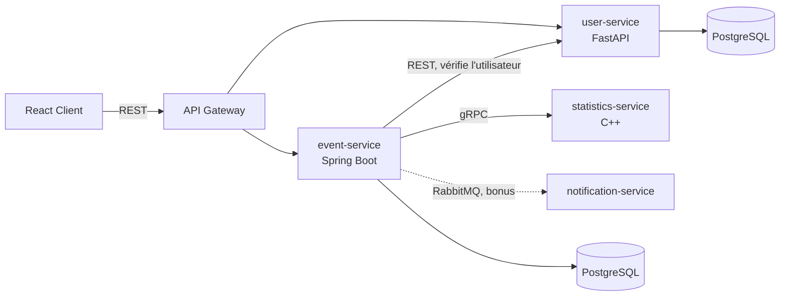

# GLYPSBUTBETTER

Application où des étudiants créent des activités/événements (tournoi Smash, foot, révision SQL, afterwork…) et rejoignent celles des autres.

## Fonctionnalités

- Créer, modifier, supprimer un événement
- Voir les événements disponibles
- S'inscrire / se désinscrire (places limitées)
- Notification à l'inscription et quand un événement est complet

## Architecture



## Services

| Dossier | Rôle | Stack |
|---|---|---|
| `frontend/` | Interface | React, Axios |
| `api-gateway/` | Routing vers les services | Spring Cloud Gateway |
| `event-service/` | Événements et inscriptions ; valide l'utilisateur via user-service et récupère les stats via statistics-service | Java 21, Spring Boot, Spring Data JPA, PostgreSQL |
| `user-service/` | Utilisateurs (CRUD) | Python, FastAPI, SQLAlchemy, PostgreSQL |
| `statistics-service/` | Calcule les statistiques d'un événement (places restantes, taux d'occupation, tendances) à la demande d'event-service ; stateless, pas de base de données | C++20, gRPC, CMake + vcpkg |

Build et tests de `statistics-service` en local (nécessite [vcpkg](https://github.com/microsoft/vcpkg)) :

```
cmake -S statistics-service -B statistics-service/build -DCMAKE_TOOLCHAIN_FILE=<chemin-vers-vcpkg>/scripts/buildsystems/vcpkg.cmake
cmake --build statistics-service/build
ctest --test-dir statistics-service/build
```

## Stack

Java 21, Spring Boot, Spring Data JPA (event-service), Python + FastAPI + SQLAlchemy (user-service), C++20 + gRPC (statistics-service), PostgreSQL, React + Axios, Maven, Docker Compose. Bonus : RabbitMQ.

## API principale (event-service)

| Méthode | Route | Description |
|---|---|---|
| GET | `/events` | Liste des événements |
| GET | `/events/{id}` | Détail |
| POST | `/events` | Création |
| PUT / DELETE | `/events/{id}` | Modification / suppression |
| POST | `/events/{id}/registrations` | Rejoindre |
| DELETE | `/events/{id}/registrations/{userId}` | Quitter |
| GET | `/events/{id}/statistics` | Statistiques détaillées de l'événement (via statistics-service) |
| GET | `/events/statistics/dashboard` | Statistiques cross-événements (via statistics-service) |

Erreurs : `EVENT_NOT_FOUND` (404), `USER_NOT_FOUND` (404), `EVENT_FULL` (400), `ALREADY_REGISTERED` (400), `INVALID_EVENT_DATE` (400).

## CI/CD

`.github/workflows/ci-cd.yml` (GitHub Actions) build et teste les trois services backend à chaque push, et publie leurs images Docker sur GHCR (`ghcr.io/<repo>-<service>`) à chaque push sur `main`.

## Lancer

```
docker compose up
```

Pour lancer sans rien build (images déjà publiées sur GHCR par la CI) :

```
docker compose -f docker-compose.images.yml up
```
