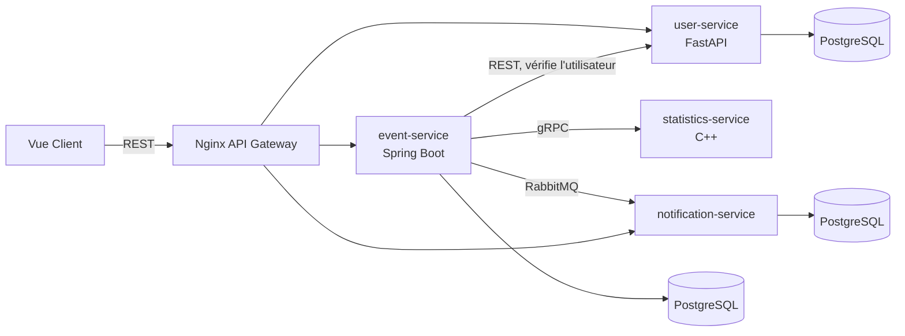

# GLYPSBUTBETTER

Application où des étudiants créent des activités/événements (tournoi Smash, foot, révision SQL, afterwork…) et rejoignent celles des autres.

## Fonctionnalités

- Créer, modifier, supprimer un événement
- Voir les événements disponibles
- S'inscrire / se désinscrire (places limitées)
- Notifications dans l'interface à l'inscription et quand un événement est complet

## Architecture



## Services

| Dossier | Rôle | Stack |
|---|---|---|
| `frontend/` | Interface | Vue 3, Vite, Axios |
| `api-gateway/` | Sert le frontend et route `/api/events`, `/api/users`, `/api/notifications` | Nginx |
| `event-service/` | Événements et inscriptions ; valide l'utilisateur via user-service et récupère les stats via statistics-service | Java 21, Spring Boot, Spring Data JPA, PostgreSQL |
| `user-service/` | Utilisateurs (CRUD) | Python, FastAPI, SQLAlchemy, PostgreSQL |
| `statistics-service/` | Calcule les statistiques d'un événement (places restantes, taux d'occupation, tendances) à la demande d'event-service ; stateless, pas de base de données | C++20, gRPC, CMake + vcpkg |
| `notification-service/` | Consomme les messages RabbitMQ, stocke et expose les notifications par utilisateur | Python, FastAPI, SQLAlchemy, PostgreSQL |

Build et tests de `statistics-service` en local (nécessite [vcpkg](https://github.com/microsoft/vcpkg)) :

```
cmake -S statistics-service -B statistics-service/build -DCMAKE_TOOLCHAIN_FILE=<chemin-vers-vcpkg>/scripts/buildsystems/vcpkg.cmake
cmake --build statistics-service/build
ctest --test-dir statistics-service/build
```

## Stack

Java 21, Spring Boot, Spring Data JPA (event-service), Python + FastAPI + SQLAlchemy (user-service et notification-service), C++20 + gRPC (statistics-service), PostgreSQL, Vue + Axios, RabbitMQ, Maven, Docker Compose.

## API principale (event-service)

| Méthode | Route | Description |
|---|---|---|
| GET | `/events` | Liste des événements |
| GET | `/events/{id}` | Détail |
| POST | `/events` | Création |
| PUT / DELETE | `/events/{id}` | Modification / suppression |
| POST | `/events/{id}/registrations` | Rejoindre |
| DELETE | `/events/{id}/registrations/{userId}` | Quitter |
| GET | `/events/{id}/statistics` | Statistiques détaillées de l'événement (via statistics-service) |
| GET | `/events/statistics/dashboard` | Statistiques cross-événements (via statistics-service) |

Erreurs : événement ou utilisateur absent (404), événement complet ou inscription en double (409), capacité ou date invalide (400).

## CI/CD

`.github/workflows/ci-cd.yml` (GitHub Actions) exécute les tests de chaque backend, le build typé du frontend, puis démarre la stack Docker complète et lance le smoke test via le gateway. Les cinq images Docker sont publiées sur GHCR (`ghcr.io/<repo>-<service>`) à chaque push sur `main` ou sur un tag `v*`.

## Tests

Chaque service backend possède ses tests : JUnit/Maven pour `event-service`, pytest pour `user-service` et `notification-service`, et GoogleTest/CTest pour `statistics-service`. Le smoke test `scripts/smoke.py` valide l'intégration de tous les services : frontend et gateway, CRUD utilisateur, événements, inscriptions, gRPC de statistiques, RabbitMQ et notifications.

## Lancer

```
docker compose up
```

Ouvrir `http://localhost:8080`. L'API passe par le même hôte sous `/api`. Pour vérifier les parcours utilisateurs, événements, inscriptions, statistiques et notifications :

```
python scripts/smoke.py
```

La connexion actuelle par email est une fonctionnalité de démonstration : elle ne vérifie pas l'identité de l'utilisateur. Les notifications sont livrées après validation de l'inscription et peuvent prendre quelques secondes.

Pour lancer sans rien build (images déjà publiées sur GHCR par la CI) :

```
docker compose -f docker-compose.images.yml up
```

Les images `api-gateway` et `notification-service` n'existent sur GHCR qu'après la publication de cette branche sur `main` ou via un tag `v*`.
